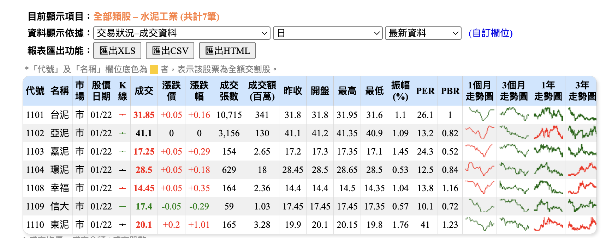

# 股票資料爬蟲程式
針對 https://goodinfo.tw/tw/StockList.asp 這個網站進行爬蟲的程式會將爬取的資料彙整成 excel 輸出

## 可設定的參數
可透過改動 config.json 調整設定
``` javascript 
{
  "url": "https://goodinfo.tw/tw2/StockList.asp?RPT_TIME=&MARKET_CAT=%E7%86%B1%E9%96%80%E6%8E%92%E8%A1%8C&INDUSTRY_CAT=%E6%88%90%E4%BA%A4%E9%87%91%E9%A1%8D+%28%E9%AB%98%E2%86%92%E4%BD%8E%29%40%40%E6%88%90%E4%BA%A4%E9%87%91%E9%A1%8D%40%40%E7%94%B1%E9%AB%98%E2%86%92%E4%BD%8E",
  "categoryMap": {
    "成交額": ["交易狀況–成交資料"],
    "當沖": ["交易狀況–現股當沖"],
    "短漲跌": ["交易狀況–漲跌及成交統計", "短期累計漲跌統計"],
    "中漲跌": ["交易狀況–漲跌及成交統計", "中期累計漲跌統計"],
    "周轉率": ["交易狀況–漲跌及成交統計", "累計成交量週轉率統計"],
    "MA": ["技術指標–移動平均線", "乖離率2(%)"],
    "法人": ["法人買賣狀況統計–三大法人", "法人買賣金額(百萬元)(日)"],
    "法人連買": ["法人買賣狀況統計–三大法人", "法人連買連賣統計(日)"],
    "自營避險": ["法人累計買賣超統計–自營商(避險)", "金額統計(百萬元)"],
    "散戶資券": ["融資融券增減統計", "資券增減統計(日)"],
    "法人借券": ["融資券累計增減統計–借券資訊", "借券賣出增減(萬元)"],
    "市值": ["公司基本資料"]
  },
  "countOptionList": ["1~300", "301~600", "601~900"],
  "headless": true,
  "conCurrentCount": 5,
  "outputPath": "./output"
}
```
### url 
url 指的是要爬取的頁面, 目前都是爬 "熱門排行/成交金額/高->低" 將來如果想改爬其他指標只需選好選項將當下的 url 貼上即可
### categoryMap

下半部的選項是動態變動沒辦法透過 url 選擇, 所以需要在這邊設定好要選擇哪些項目
``` javascript
  "categoryMap": {
    
    //ex: "{要彙整出的 excel tab 的名字}": ["{要選的第一個選項}", "{要選的第二個選項}""],
    "成交額": ["交易狀況–成交資料"],
    "短漲跌": ["交易狀況–漲跌及成交統計", "短期累計漲跌統計"],
    // 假如想新增一項 "獲利能力" 可以這樣設定 
    "獲利能力": ["獲利能力–單季", "獲利能力 (季增減統計)"],
    // (選項的字需跟網站上一樣, 目前只支援到兩個選項,將來如果遇到要選三個的再擴充)
  },
```

### countOptionList
代表要抓取的數量
``` javascript
 // 如果要改抓 1-1200 (字需要跟網站上的選項一樣)
 "countOptionList": ["1~300", "301~600", "601~900", "901~1200"]
```

### headless
如果為 `false` 可以看到抓取的過程但效能較差

### conCurrentCount
同時抓取的項目數量, 實測同時抓取太多項目程式有機率卡住, 目前先設定為 5 可微調

### outputPath
output 到哪一個資料夾